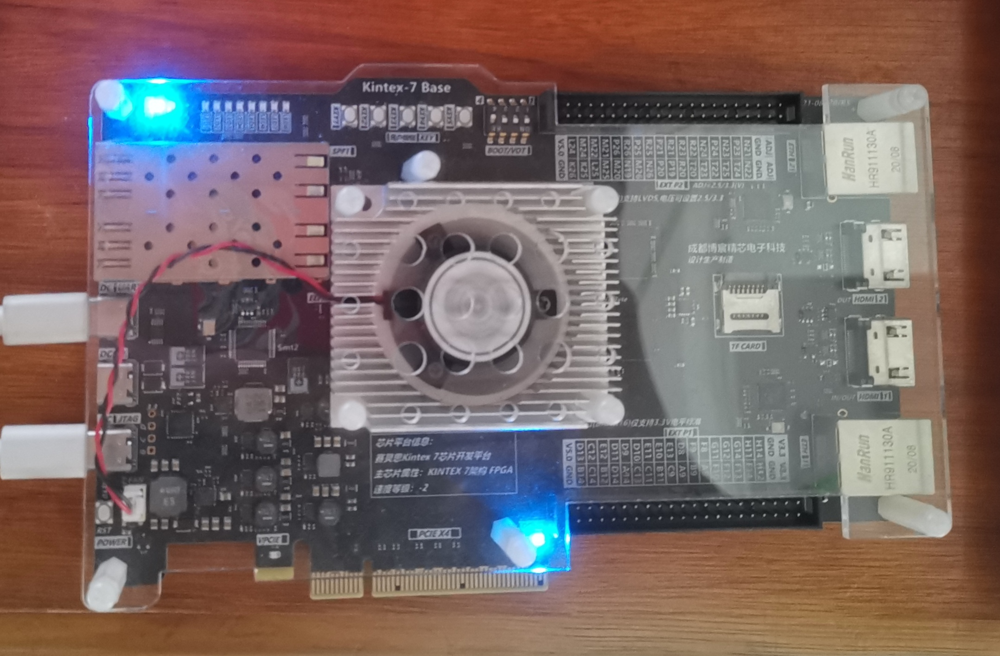

# Port TinyMaix to CORE CM0 on Kintex-7 FPGA

## Chip

| Item  | Parameter |
| ----- | --------- |
| Chip  | Arm Cortex-M0 SoftCore on Kintex-7 FPGA |
| Arch  | ARMv6M    |
| Freq  | 50M       |
| Flash | NULL (all in BRAM) |
| RAM   | 1MB (BRAM allocated) |

## Board

Xilinx Kintex-7(xc7k325tffg676-2)

<a href="assets/Xilinx_Kintex-7_FPGA.jpg"></a>

## Development Environment

Keil MDK5

## Step/Project

Just simple edit `tm_port.h`

## Result

```
cifar10 demo
================================ model stat ================================
mdl_type=0 (int8))
out_deq=1 
input_cnt=1, output_cnt=1, layer_cnt=6
input 3dims: (32, 32, 3)
output 1dims: (1, 1, 10)
main buf size 11264; sub buf size 0
//Note: PARAM is layer param size, include align padding

Idx	Layer	         outshape	inoft	outoft	PARAM	MEMOUT OPS
---	Input    	 32, 32,  3	-   	0    	0 	3072 	0
###L70: body oft = 64
###L71: type=0, is_out=0, size=2736, in_oft=0, out_oft=3072, in_dims=[3,32,32,3], out_dims=[3,16,16,32], in_s=0.004, in_zp=-128, out_s=0.060, out_zp=-128
###L84: Conv2d: kw=5, kh=5, sw=2, sh=2, dw=1, dh=1, act=1, pad=[1,2,1,2], dmul=0, ws_oft=80, w_oft=208, b_oft=2608
000	Conv2D      	 16, 16, 32	0	3072	2656	8192	614400
###L70: body oft = 2800
###L71: type=0, is_out=0, size=25936, in_oft=3072, out_oft=0, in_dims=[3,16,16,32], out_dims=[3,8,8,32], in_s=0.060, in_zp=-128, out_s=0.022, out_zp=-128
###L84: Conv2d: kw=5, kh=5, sw=2, sh=2, dw=1, dh=1, act=1, pad=[1,2,1,2], dmul=0, ws_oft=80, w_oft=208, b_oft=25808
001	Conv2D      	  8,  8, 32	3072	0	25856	2048	1638400
###L70: body oft = 28736
###L71: type=0, is_out=0, size=51792, in_oft=0, out_oft=10240, in_dims=[3,8,8,32], out_dims=[3,4,4,64], in_s=0.022, in_zp=-128, out_s=0.008, out_zp=-128
###L84: Conv2d: kw=5, kh=5, sw=2, sh=2, dw=1, dh=1, act=1, pad=[1,2,1,2], dmul=0, ws_oft=80, w_oft=336, b_oft=51536
002	Conv2D      	  4,  4, 64	0	10240	51712	1024	819200
###L70: body oft = 80528
###L71: type=4, is_out=0, size=48, in_oft=10240, out_oft=10240, in_dims=[3,4,4,64], out_dims=[1,1,1,1024], in_s=0.008, in_zp=-128, out_s=0.008, out_zp=-128
003	Reshape      	  1,  1,1024	10240	10240	0	1024	0
###L70: body oft = 80576
###L71: type=2, is_out=0, size=10384, in_oft=10240, out_oft=0, in_dims=[1,1,1,1024], out_dims=[1,1,1,10], in_s=0.008, in_zp=-128, out_s=0.069, out_zp=55
###L95: FC: ws_oft=64, w_oft=104, b_oft=10344
004	FC      	  1,  1, 10	10240	0	10320	10	10240
###L70: body oft = 90960
###L71: type=3, is_out=1, size=48, in_oft=0, out_oft=11208, in_dims=[1,1,1,10], out_dims=[1,1,1,10], in_s=0.069, in_zp=55, out_s=0.004, out_zp=-128
005	Softmax      	  1,  1, 10	0	11208	0	10	60

Total param ~88.4 KB, OPS ~3.08 MOPS, buffer 11.0 KB

===tm_run use 1668 ms
0: 0.004
1: 0.000
2: 0.973
3: 0.004
4: 0.023
5: 0.004
6: 0.004
7: 0.004
8: 0.004
9: 0.004
### Predict output is: Class 2, bird, prob 0.973
```

| config | mnist | cifar | Note |
| ------ | ----- | ----- | ---- |
| O0 CPU | 26    | 1668  |      |
| O1 CPU | 23    | 1362  |      |

## Author

[zeroherolin](https://github.com/zeroherolin) 