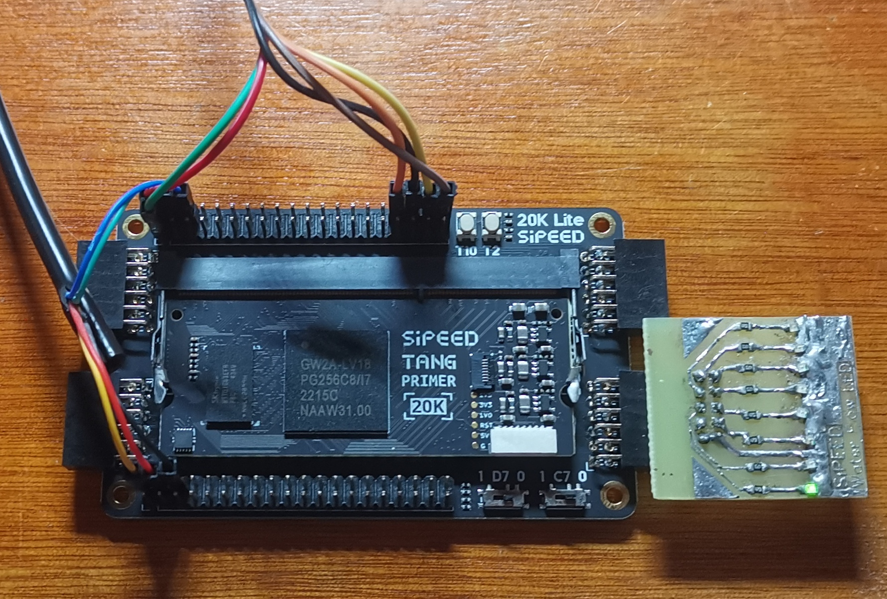

# Port TinyMaix to PicoRV32 on GW2A FPGA

## Chip

| Item  | Parameter |
| ----- | --------- |
| Chip  | PicoRV32 on GW2A FPGA  |
| Arch  | RV32I     |
| Freq  | 54M       |
| Flash | 1MB       |
| RAM   | 64KB      |

## Board

Tang Primer 20K FPGA

<a href="assets/Tang_Primer_20K_FPGA.jpg"></a>

## Development Environment

GMD

## Step/Project

Just simple edit `tm_port.h`

## Result

```
Booting..
System clock is 54000000..
Press ENTER to continue..

  ____  _          ____         ____
 |  _ \(_) ___ ___/ ___|  ___  / ___|
 | |_) | |/ __/ _ \___ \ / _ \| |
 |  __/| | (_| (_) |__) | (_) | |___
 |_|   |_|\___\___/____/ \___/ \____|

mnist demo
  0,  0,  0,  0,  0,  0,  0,  0,  0,  0,  0,  0,  0,  0,  0,  0,  0,  0,  0,  0,  0,  0,  0,  0,  0,  0,  0,  0,
  0,  0,  0,  0,  0,  0,  0,  0,  0,  0,  0,  0,  0,  0,  0,  0,  0,  0,  0,  0,  0,  0,  0,  0,  0,  0,  0,  0,
  0,  0,  0,  0,  0,  0,  0,  0,  0,  0,  0,  0,  0,  0,  0,  0,  0,  0,  0,  0,  0,  0,  0,  0,  0,  0,  0,  0,
  0,  0,  0,  0,  0,  0,  0,  0,  0,  0,116,125,171,255,255,150, 93,  0,  0,  0,  0,  0,  0,  0,  0,  0,  0,  0,
  0,  0,  0,  0,  0,  0,  0,  0,  0,169,253,253,253,253,253,253,218, 30,  0,  0,  0,  0,  0,  0,  0,  0,  0,  0,
  0,  0,  0,  0,  0,  0,  0,  0,169,253,253,253,213,142,176,253,253,122,  0,  0,  0,  0,  0,  0,  0,  0,  0,  0,
  0,  0,  0,  0,  0,  0,  0, 52,250,253,210, 32, 12,  0,  6,206,253,140,  0,  0,  0,  0,  0,  0,  0,  0,  0,  0,
  0,  0,  0,  0,  0,  0,  0, 77,251,210, 25,  0,  0,  0,122,248,253, 65,  0,  0,  0,  0,  0,  0,  0,  0,  0,  0,
  0,  0,  0,  0,  0,  0,  0,  0, 31, 18,  0,  0,  0,  0,209,253,253, 65,  0,  0,  0,  0,  0,  0,  0,  0,  0,  0,
  0,  0,  0,  0,  0,  0,  0,  0,  0,  0,  0,  0,  0,117,247,253,198, 10,  0,  0,  0,  0,  0,  0,  0,  0,  0,  0,
  0,  0,  0,  0,  0,  0,  0,  0,  0,  0,  0,  0, 76,247,253,231, 63,  0,  0,  0,  0,  0,  0,  0,  0,  0,  0,  0,
  0,  0,  0,  0,  0,  0,  0,  0,  0,  0,  0,  0,128,253,253,144,  0,  0,  0,  0,  0,  0,  0,  0,  0,  0,  0,  0,
  0,  0,  0,  0,  0,  0,  0,  0,  0,  0,  0,176,246,253,159, 12,  0,  0,  0,  0,  0,  0,  0,  0,  0,  0,  0,  0,
  0,  0,  0,  0,  0,  0,  0,  0,  0,  0, 25,234,253,233, 35,  0,  0,  0,  0,  0,  0,  0,  0,  0,  0,  0,  0,  0,
  0,  0,  0,  0,  0,  0,  0,  0,  0,  0,198,253,253,141,  0,  0,  0,  0,  0,  0,  0,  0,  0,  0,  0,  0,  0,  0,
  0,  0,  0,  0,  0,  0,  0,  0,  0, 78,248,253,189, 12,  0,  0,  0,  0,  0,  0,  0,  0,  0,  0,  0,  0,  0,  0,
  0,  0,  0,  0,  0,  0,  0,  0, 19,200,253,253,141,  0,  0,  0,  0,  0,  0,  0,  0,  0,  0,  0,  0,  0,  0,  0,
  0,  0,  0,  0,  0,  0,  0,  0,134,253,253,173, 12,  0,  0,  0,  0,  0,  0,  0,  0,  0,  0,  0,  0,  0,  0,  0,
  0,  0,  0,  0,  0,  0,  0,  0,248,253,253, 25,  0,  0,  0,  0,  0,  0,  0,  0,  0,  0,  0,  0,  0,  0,  0,  0,
  0,  0,  0,  0,  0,  0,  0,  0,248,253,253, 43, 20, 20, 20, 20,  5,  0,  5, 20, 20, 37,150,150,150,147, 10,  0,
  0,  0,  0,  0,  0,  0,  0,  0,248,253,253,253,253,253,253,253,168,143,166,253,253,253,253,253,253,253,123,  0,
  0,  0,  0,  0,  0,  0,  0,  0,174,253,253,253,253,253,253,253,253,253,253,253,249,247,247,169,117,117, 57,  0,
  0,  0,  0,  0,  0,  0,  0,  0,  0,118,123,123,123,166,253,253,253,155,123,123, 41,  0,  0,  0,  0,  0,  0,  0,
  0,  0,  0,  0,  0,  0,  0,  0,  0,  0,  0,  0,  0,  0,  0,  0,  0,  0,  0,  0,  0,  0,  0,  0,  0,  0,  0,  0,
  0,  0,  0,  0,  0,  0,  0,  0,  0,  0,  0,  0,  0,  0,  0,  0,  0,  0,  0,  0,  0,  0,  0,  0,  0,  0,  0,  0,
  0,  0,  0,  0,  0,  0,  0,  0,  0,  0,  0,  0,  0,  0,  0,  0,  0,  0,  0,  0,  0,  0,  0,  0,  0,  0,  0,  0,
  0,  0,  0,  0,  0,  0,  0,  0,  0,  0,  0,  0,  0,  0,  0,  0,  0,  0,  0,  0,  0,  0,  0,  0,  0,  0,  0,  0,
  0,  0,  0,  0,  0,  0,  0,  0,  0,  0,  0,  0,  0,  0,  0,  0,  0,  0,  0,  0,  0,  0,  0,  0,  0,  0,  0,  0,
================================ model stat ================================
mdl_type=0 (int8))
out_deq=1 
input_cnt=1, output_cnt=1, layer_cnt=6
input 3dims: (28, 28, 1)
output 1dims: (1, 1, 10)
main buf size 1464; sub buf size 0
//Note: PARAM is layer param size, include align padding

Idx	Layer	         outshape	inoft	outoft	PARAM	MEMOUT OPS
---	Input    	 28, 28,  1	-   	0    	0 	784 	0
###L77: body oft = 64
###L82: type=0, is_out=0, size=152, in_oft=0, out_oft=784, in_dims=[3,28,28,1], out_dims=[3,13,13,4], in_s=0.004, in_zp=-128, out_s=0.016, out_zp=-128
###L94: Conv2d: kw=3, kh=3, sw=2, sh=2, dw=1, dh=1, act=1, pad=[0,0,0,0], dmul=0, ws_oft=80, w_oft=96, b_oft=136
000	Conv2D      	 13, 13,  4	0	784	72	676	6084
###L77: body oft = 216
###L82: type=0, is_out=0, size=432, in_oft=784, out_oft=0, in_dims=[3,13,13,4], out_dims=[3,6,6,8], in_s=0.016, in_zp=-128, out_s=0.016, out_zp=-128
###L94: Conv2d: kw=3, kh=3, sw=2, sh=2, dw=1, dh=1, act=1, pad=[0,0,0,0], dmul=0, ws_oft=80, w_oft=112, b_oft=400
001	Conv2D      	  6,  6,  8	784	0	352	288	10368
###L77: body oft = 648
###L82: type=0, is_out=0, size=1360, in_oft=0, out_oft=1400, in_dims=[3,6,6,8], out_dims=[3,2,2,16], in_s=0.016, in_zp=-128, out_s=0.057, out_zp=-128
###L94: Conv2d: kw=3, kh=3, sw=2, sh=2, dw=1, dh=1, act=1, pad=[0,0,0,0], dmul=0, ws_oft=80, w_oft=144, b_oft=1296
002	Conv2D      	  2,  2, 16	0	1400	1280	64	4608
###L77: body oft = 2008
###L82: type=1, is_out=0, size=48, in_oft=1400, out_oft=0, in_dims=[3,2,2,16], out_dims=[1,1,1,16], in_s=0.057, in_zp=-128, out_s=0.022, out_zp=-128
003	GAP      	  1,  1, 16	1400	0	0	16	64
###L77: body oft = 2056
###L82: type=2, is_out=0, size=304, in_oft=0, out_oft=1448, in_dims=[1,1,1,16], out_dims=[1,1,1,10], in_s=0.022, in_zp=-128, out_s=0.151, out_zp=42
###L103: FC: ws_oft=64, w_oft=104, b_oft=264
004	FC      	  1,  1, 10	0	1448	240	10	160
###L77: body oft = 2360
###L82: type=3, is_out=1, size=48, in_oft=1448, out_oft=0, in_dims=[1,1,1,10], out_dims=[1,1,1,10], in_s=0.151, in_zp=42, out_s=0.004, out_zp=-128
005	Softmax      	  1,  1, 10	1448	0	0	10	60

Total param ~1.9 KB, OPS ~0.02 MOPS, buffer 1.4 KB

===tm_run use 385 ms
0: 0.004
1: 0.004
2: 0.996
3: 0.004
4: 0.000
5: 0.000
6: 0.004
7: 0.004
8: 0.004
9: 0.004
### Predict output is: Number 2, prob 0.996
```

| config | mnist | cifar | kws64-4k | kws64-8k | Note |
| ------ | ----- | ----- | -------- | ---------| ---- |
| O0 CPU | 423   | 30461 | 2831     | 4016     |      |
| O1 CPU | 385   | 26935 | 2470     | 3497     |      |

## Author

[zeroherolin](https://github.com/zeroherolin) 