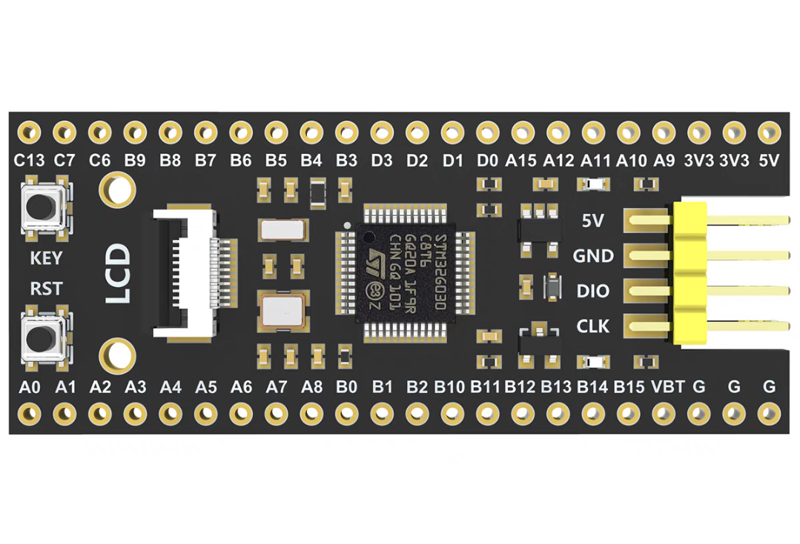

# Port TinyMaix to STM32G030

## Chip

| Item  | Parameter              |
| ----- | ---------------------- |
| Chip  | STM32G030               |
| Arch  | ARM Cortex-M0+ |
| Freq  | 64M                    |
| Flash | 64KB                   |
| RAM   | 8KB                   |

## Board 

FK-G030M1-C8T6

## Development Environment

MDK 5.20

## Step/Project

Just simple edit `tm_port.h`

https://github.com/XOXVXOX/stm32G030_tinyMaix.git

## Result

| config | mnist | Note |
| ------ | ----- | ---- |
| O0 CPU | 18    |      |

## Author

[Higanbana](https://github.com/XOXVXOX) 