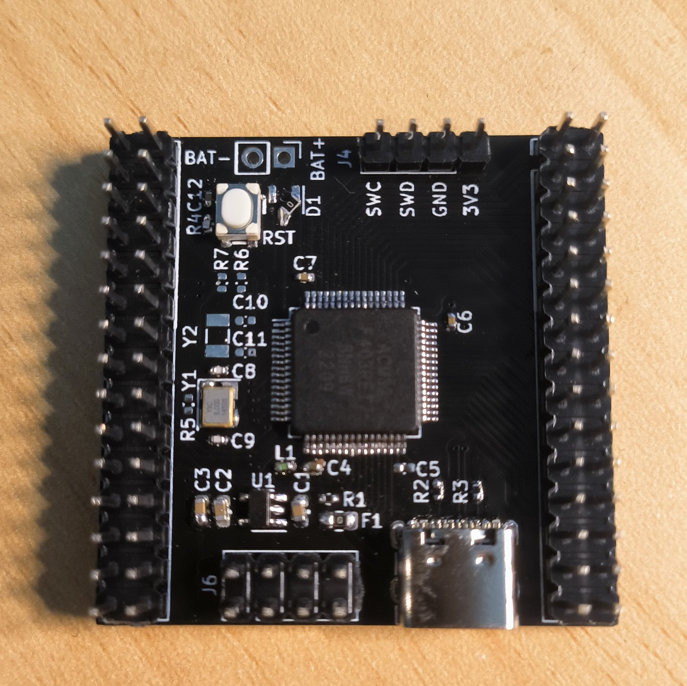

# Port TinyMaix to ACM32F403

## Chip

| Item         | Parameter      |
| ------------ | -------------- |
| Chip         | ACM32F403      |
| Arch         | ARM Cortex M33 |
| Freq         | 180M           |
| Flash        | 512KB          |
| RAM          | 192KB          |
| Acceleration | ARM SIMD       |

## Board 

## Development Environment

MDK 5.35

## Step/Project

Just simple edit `tm_port.h`

https://github.com/dreamcmi/ACM32F403-TinyMaix

## Result

| config  | mnist | cifar  | vww96  | mbnet128 | Note |
| ------- | ----- | ------ | ------ | -------- | ---- |
| O0 CPU  | 2.66  | 182.58 | 486.64 | XXX      |      |
| O1 CPU  | 2.20  | 138.63 | 494.81 | XXX      |      |
| O0 SIMD | 2.27  | 157.55 | 458.17 | XXX      |      |
| O1 SIMD | 2.04  | 141.06 | 469.09 | XXX      |      |

## Author

[Darren Cheng](https://github.com/dreamcmi) 

