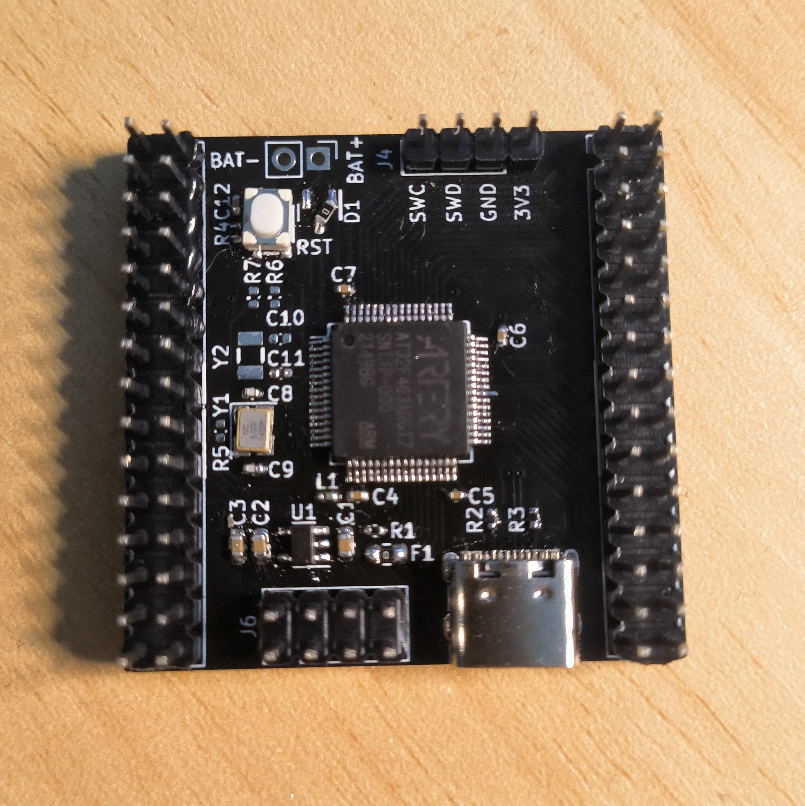

# Port TinyMaix to AT32F403A

## Chip

| Item         | Parameter                     |
| ------------ | ----------------------------- |
| Chip         | AT32F403A                     |
| Arch         | ARM Cortex M4                 |
| Freq         | 240M                          |
| Flash        | 1024KB(256KB zero wait-state) |
| RAM          | 96KB                          |
| Acceleration | ARM SIMD                      |

## Board 

## Development Environment

MDK 5.35

## Step/Project

Just simple edit `tm_port.h`

https://github.com/dreamcmi/AT32F403A-TinyMaix

## Result

| config  | mnist | cifar | vww96  | mbnet96 | mbnet128 | Note                          |
| ------- | ----- | ----- | ------ | ------- | -------- | ----------------------------- |
| O0 CPU  | 0.93  | 66.30 | 176.66 | 213.89  | 577.62   | mbnet128 run in 224k ram mode |
| O1 CPU  | 0.75  | 46.53 | 188.83 | 230.87  | 614.43   | mbnet128 run in 224k ram mode |
| O0 SIMD | 0.69  | 41.11 | 135.77 | 169.12  | 476.61   | mbnet128 run in 224k ram mode |
| O1 SIMD | 0.61  | 30.01 | 144.58 | 182.39  | 506.26   | mbnet128 run in 224k ram mode |

## Author

[Darren Cheng](https://github.com/dreamcmi) 

