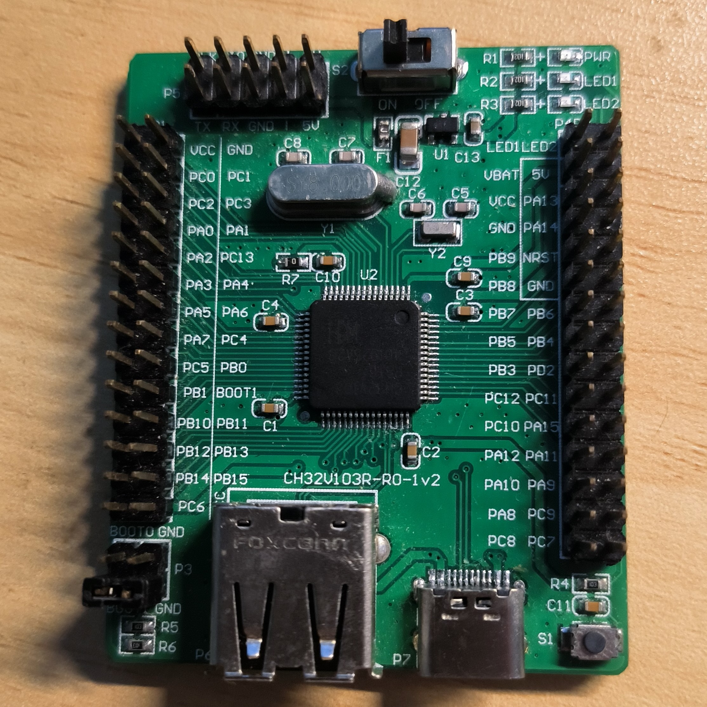

# Port TinyMaix to CH32V103

## Chip

| Item  | Parameter              |
| ----- | ---------------------- |
| Chip  | CH32V103               |
| Arch  | RV32 IMAC (QingKe V3A) |
| Freq  | 72M                    |
| Flash | 64KB                   |
| RAM   | 20KB                   |

## Board 

CH32V103R-R0-1v2

## Development Environment

MounRiver Studio

## Step/Project

Just simple edit `tm_port.h`

https://github.com/dreamcmi/CH32V103-TinyMaix

## Result

| config | mnist | Note |
| ------ | ----- | ---- |
| O0 CPU | 14.17 |      |
| O1 CPU | 12.58 |      |

## Author

[Darren Cheng](https://github.com/dreamcmi) 

