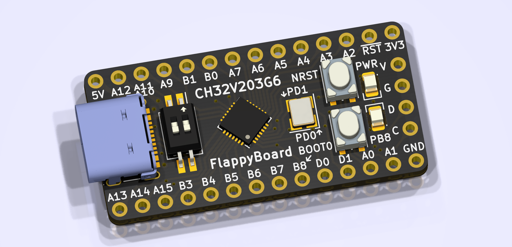

# Port TinyMaix to CH32V203

## Chip

| Item  | Parameter              |
| ----- | ---------------------- |
| Chip  | CH32V203               |
| Arch  | RV32 IMAC (QingKe V4B) |
| Freq  | 144MHz                 |
| Flash | 32KB                   |
| RAM   | 10KB                   |

## Board

[FlappyBoard Rev A.3](https://github.com/metro94/FlappyBoard)

## Development Environment

riscv-none-embed-gcc

## Step/Project

Just simple edit `tm_port.h`

Porting Project in:   
https://github.com/metro94/CH32V203-TinyMaix

## Result

| config | mnist | cifar | vww96  | mbnet128 | Note |
| ------ | ----- | ----- | ------ | -------- | ---- |
| Os CPU | 2.51  |       |        |          |      |

### **Author**

[Metro94](https://github.com/metro94) 
