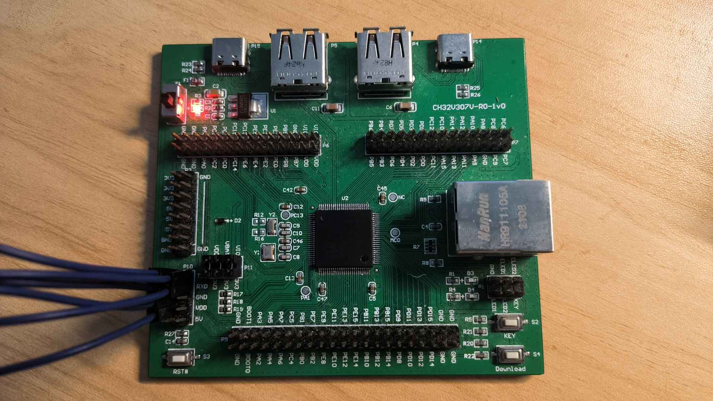

# Port TinyMaix to CH32V307

## Chip

| Item  | Parameter               |
| ----- | ----------------------- |
| Chip  | CH32V307                |
| Arch  | RV32 IMACF (QingKe V4F) |
| Freq  | 144M                    |
| Flash | 480KB                   |
| RAM   | 128KB                   |

## Board

CH32V307V-R0-1v0

## Development Environment

riscv-none-embed-gcc

## Step/Project

Just simple edit `tm_port.h`

Porting Project in:   
https://github.com/dreamcmi/CH32V307-TinyMaix

## Result

| config | mnist | cifar | vww96  | mbnet128 | Note |
| ------ | ----- | ----- | ------ | -------- | ---- |
| O0 CPU | 1.23  | 75.77 | 356.92 | XXX      |      |
| O1 CPU | 1.14  | 63.78 | 362.62 | XXX      |      |

**PS: Because the flash of the CH32V307 chip has a 0 wait area, there will be a waiting time in the part after the FLASH REGION exceeds 192k.**

### **Author**

[Darren Cheng](https://github.com/dreamcmi) 
