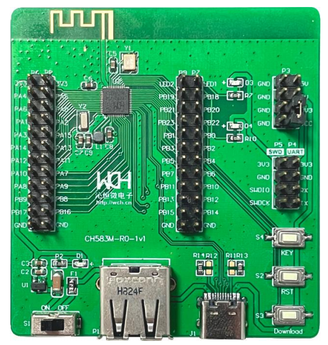

# Port TinyMaix to CH582

## Chip

| Item  | Parameter              |
| ----- | ---------------------- |
| Chip  | CH582                  |
| Arch  | RV32 IMAC (QingKe V4A) |
| Freq  | 60M                    |
| Flash | 448KB                  |
| RAM   | 32KB                   |

## Board

CH582EVT

## Development Environment

riscv-none-embed-gcc

## Step/Project

Just simple edit `tm_port.h`

Porting Project in:   
https://github.com/HaiMianBBao/CH582-TinyMaix

## Result

| config | mnist | Note |
| ------ | ----- | ---- |
| O0 CPU | 36.6  |      |
| O1 CPU | 31.1  |      |

### **Author**

[HaiMianBBao](https://github.com/HaiMianBBao) 
