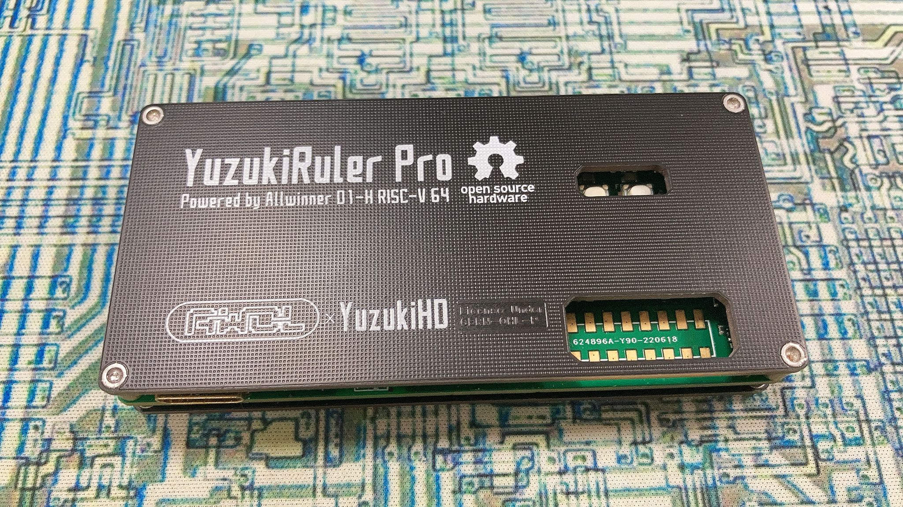

# Port TinyMaix to D1-H

### Test Chip

| Item         | Parameter      |
| ------------ | -------------- |
| Chip         | Allwinner D1-H |
| Arch         | Xuantie C906   |
| Freq         | 1008MHz        |
| Flash        | 128GByte       |
| RAM          | 2GByte         |
| Acceleration | RVV 0.7        |

### Board

### Development Environment
Tina Linux 

### Step/Project
Nothing, just compile with `-march=rv64gcv0p7_zfh_xtheadc -mabi=lp64d -mtune=c906`

### Result

TM_MDL_INT8 (ms)

| config | mnist | cifar | vww96  | mbnet128 |
| ------ | ----- | ----- | ------ | -------- |
| O0 RV64V | 0.397 | 4.956 | 30.440 | 59.911   |
| O1 RV64V | 0.342 | 4.786 | 29.320 | 58.957   |

TM_MDL_FP16 (ms)

| config | mbnet128 | mbnet224 |
| ------ | -------- | -------- |
| O0 RV64V | 63.610   | 1521.823 |
| O1 RV64V | 42.911   | 1451.777 |

### Author
YuzukiTsuru <gloomyghost@gloomyghost.com>
