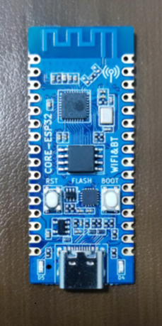

# Port TinyMaix to ESP32-C3

## Chip

| Item         | Parameter      |
| ------------ | -------------- |
| Chip         | ESP32-C3      |
| Arch         | RISC-V |
| Freq         | 160M         |
| Flash        | 4MB          |
| RAM          | 400KB          |
| Acceleration | None       |

## Board

## Development Environment

platformio + arduino framework

## Step/Project

disable TM_LOCAL_MATH in  `tm_port.h`

https://github.com/Sunuywq/TinyMaix-ESP-Arduino

# Result

| config | mnist | cifar | vww96  | mbnet128 | Note |
| ------ | ----- | ----- | ------ | -------- | ---- |
| O0 CPU | 6  | 169 | 1430 | 2599   |      |
| O1 CPU | 6  | 127 | 1551 | 2370   |      |

## Author

[Echo_Sun_2022](https://github.com/Sunuywq)  
[Legend](https://github.com/liux-pro) 
