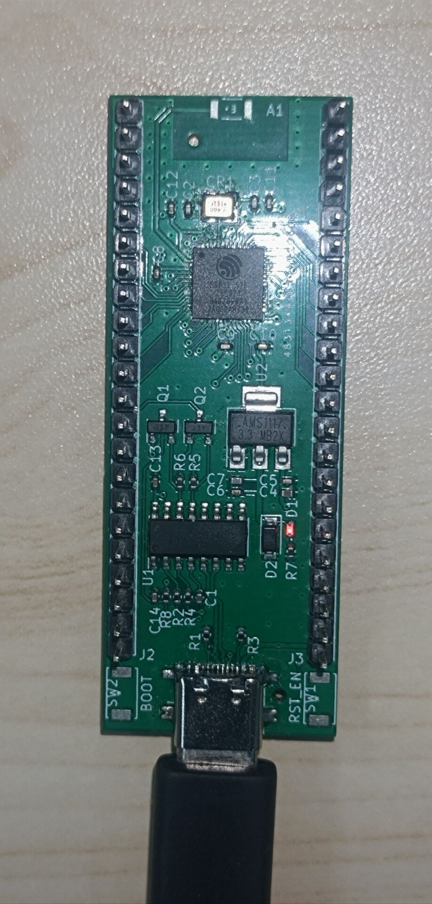

# Port TinyMaix to ESP32-S2

## Chip
|Item |Parameter|
|--   |--|
|Chip |ESP32-S2|
|Arch |Xtensa LX7|
|Freq |240M |
|Flash|4MB |
|RAM  |320KB |
|Acceleration| NONE|

## Board
Self-designed ESP32S2-FH4 miniboard

## Development Environment
ESP-IDF 4.4 under Windows

## Step/Project

Edit "tm_port.h" and Register TinyMaix as a component of esp32 project

Porting Project in:   
https://github.com/haberzero/TinyMaix_ESP32S2

## Build Config
SPI Flash : QIO, 80MHz
CPU Freq : 240MHz
TM_ARCH : TM_ARCH_CPU
TM_MDL_TYPE : TM_MDL_INT8
TM_FASTSCALE : Enabled
TM_LOCAL_MATH : Disabled

## Result
|config  |mnist|cifar|vww96|mbnet128|Note|
|---     |---  |---  |---    |---     |---|
|O0 CPU  |3    |258  |685    |1241     ||
|O1 CPU  |2.5    |241  |659    |1079     ||

## Note
The test board is a self-designed miniboard, the project environment is vscode + Espressif IDF plugin.

Almost all necessary source files have been packaged in the components folder.

Teoretically, this project configuration can be compatible with all ESP32 series chips.

## Author
yunnan_shinan@qq.com

