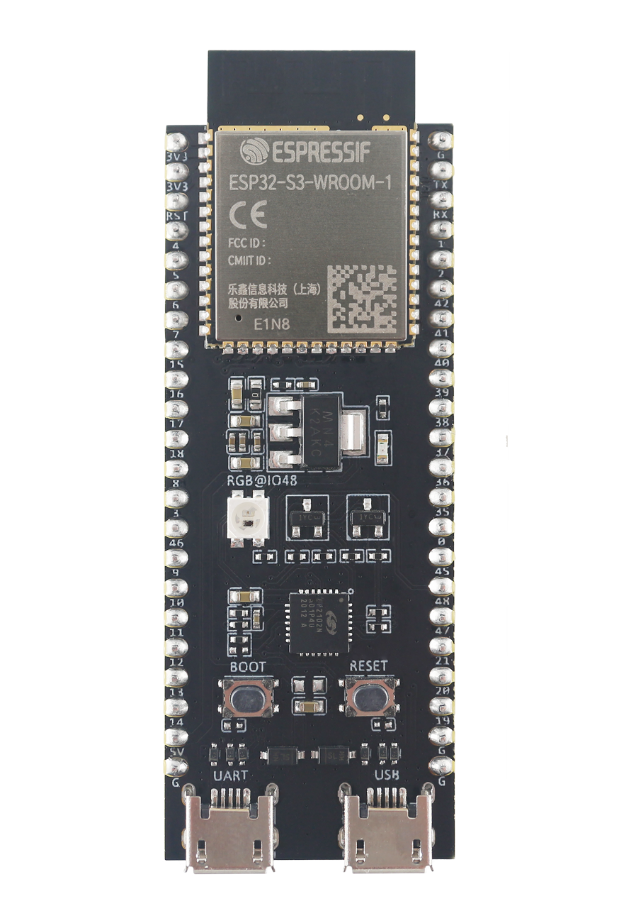

# Port TinyMaix to ESP32

## Chip

| Item  | Parameter    |
| ----- | ------------ |
| Chip  | ESP32S3      |
| Arch  | Xtensa LX7   |
| Freq  | 240M         |
| Flash | 8MB          |
| RAM   | 512KB        |

## Board

ESP32-S3-DevKitC-1

## Development Environment

ESP-IDF 4.4.2 under MacOS

## Step/Project

Just simple edit `tm_port.h`

Porting Project in:  
https://github.com/FantasyGmm/TinyMaix-Esp32S3

## Result

> Build configuration: CPU 240MHz, Flash 120MHz QIO, Compiler esp-2021r2-8.4.0 -Os (-O2 causes an internal compiler error)

| config | mnist | cifar | vww96  | mbnet128 | Note |
| ------ | ----- | ----- | ------ | -------- | ---- |
| O0 CPU | 4.75  | 111.09| 380.82 | 697.55   |      |
| O1 CPU | 4.73  | 85.98 | 382.18 | 610.15   |      |

### **Author**

[FantasyGmm](https://github.com/FantasyGmm)  
