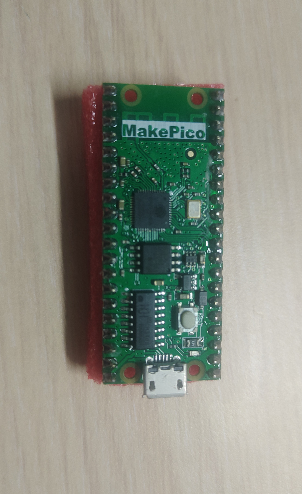

# Port TinyMaix to ESP32

## Chip

| Item  | Parameter    |
| ----- | ------------ |
| Chip  | ESP32        |
| Arch  | Xtensa LX6   |
| Freq  | 240M         |
| Flash | 4MB          |
| RAM   | 520KB        |

## Board

MakePico ESP32

## Development Environment

ESP-IDF 4.4 under Linux

## Step/Project

Just simple edit `tm_port.h`

Porting Project in:  
https://github.com/happyme531/TinyMaix-espidf_test

## Result

> Build configuration: CPU 240MHz, Flash 80MHz QIO, Compiler esp-2021r2-8.4.0 -Os (-O2 causes an internal compiler error)

| config | mnist | cifar | vww96  | mbnet128 | Note |
| ------ | ----- | ----- | ------ | -------- | ---- |
| O0 CPU | 2.29  | 167.8 | 480.48 | 865.04   |      |
| O1 CPU | 1.92  | 132.1 | 476.45 | 754.54   |      |

**PS: There is a library [esp-dsp](https://docs.espressif.com/projects/esp-dsp) that provide optimized implementation of some dsp algorithm such as dot product. Further acceleation is possible.**

### **Author**

[happyme531](https://github.com/happyme531)  
