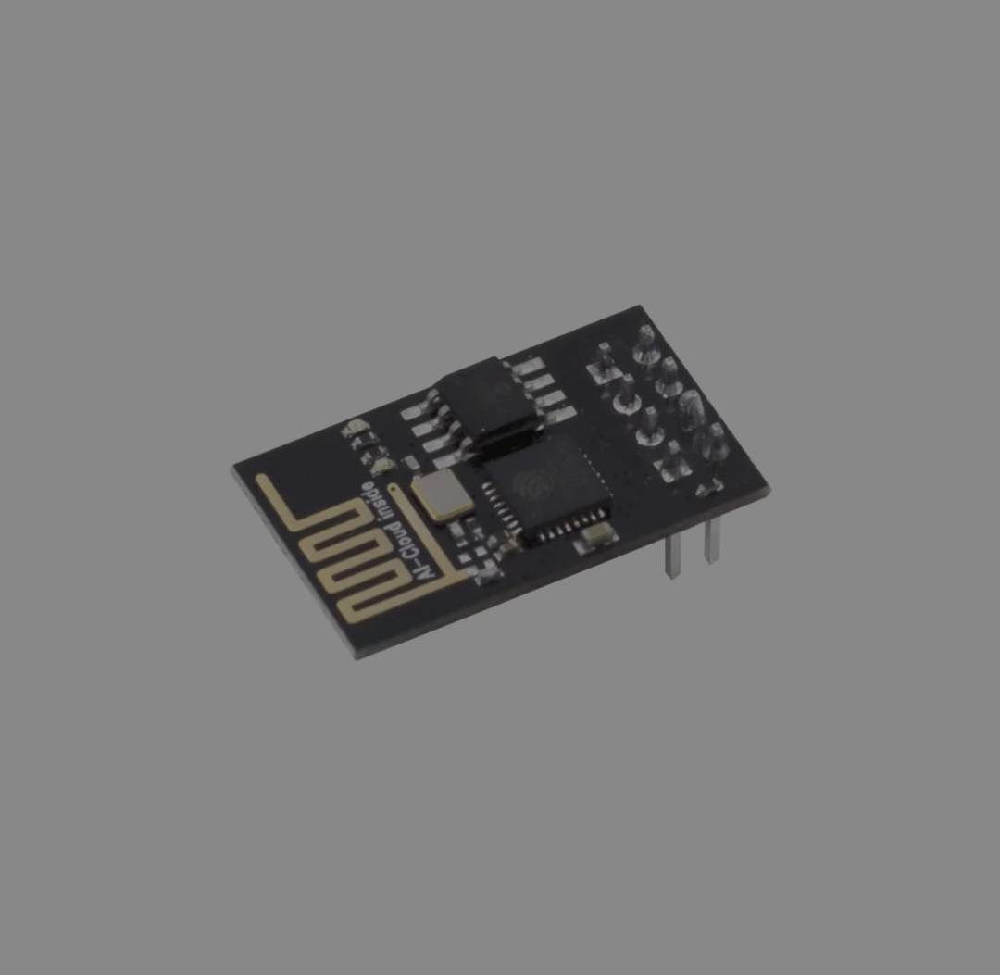

# Port TinyMaix to ESP8266

## Chip

| Item         | Parameter      |
| ------------ | -------------- |
| Chip         | ESP8266EX     |
| Arch         | Tensilica L106 |
| Freq         | 80M           |
| Flash        | 512KB          |
| RAM         | 160KB(~50KB available) |

## Board 

## Development Environment

Arduino & Platformio

## Step/Project

Just simple edit `tm_port.h`

#define  TM_GET_US()       (millis())

https://github.com/Basicname/TinyMaix-ESP8266_Port

## Result

| config | mnist | Note |
| ------ | ----- | ---- |
| Os CPU | 12    |      |

## Author

[basicname](https://github.com/Basicname)

