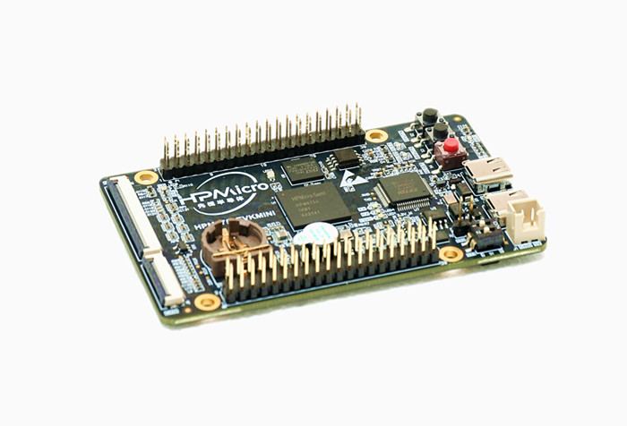

# Port TinyMaix to HPM6750EVKMINI

## Chip
|Item |Parameter|
|--   |--|
|Chip |HPM6750|
|Arch |RISC-V (Andes D45, with RV32-IMAFDCP support)|
|Freq |816M |
|Flash|8MB (External QSPI Flash)|
|RAM  |2MB SRAM + 32MB (External SDRAM)|
| Acceleration | RISC-V P(DSP) |


## Board

HPM6750EVKMINI:




## Development Environment

SEGGER Embedded Studio for RISC-V 6.40

With GCC 12.20 cc1/cc1plus/as


## Step/Project
Update macros in `tm_port.h` :

```c
#define TM_ARCH         TM_ARCH_CPU
#define TM_LOCAL_MATH   (1)         //use local math func (like exp()) to avoid libm
#define TM_GET_US()     (uint32_t)(HPM_MCHTMR->MTIME * 1000000uLL / clock_get_frequency(clock_mchtmr0))
```


Porting Project in:

https://github.com/xusiwei/HPM6750_TinyMaix


Benchmark project in:
https://github.com/xusiwei/HPM6750_TinyMaix_Benchmark


Generate SEGGER Embedded Studio project with:

```bash
generate_project -b hpm6750evkmini -t flash_xip -f
```


## Result

### Case 1: TM_MDL_INT8 + TM_OPT0

|Optimization Level  |mnist|cifar|vww96|mbnet128|Note|
|---     |---  |---  |---    |---     |---|
|None  |1.111    |90.570  |281.900    |515.106     ||
|Level 0  |1.111    |90.639  |281.902    |515.108     |*|
|Level 1 |0.526    |33.362  |119.447    |216.624     |*|
|Level 2 for speed | 0.461 |29.313   |105.515    |191.370     |*|

* In SEGGER Embedded Studio,  you can change optimization config in menu `Project 'xxx' Options -> Code -> Code Generation -> Optimization Level`.
* In SEGGER Embedded Studio,  the default heap size is `16384` bytes, it's not enough to run vww96 and mbnet128 model. You can change heap size config in menu `Code -> Runtime Memory Area -> Heap Size`, likes `262144`.


### Case 2: TM_MDL_INT8 + TM_OPT1

| Optimization Level | mnist | cifar   | vww96   | mbnet128 | Note |
| ------------------ | ----- | ------- | ------- | -------- | ---- |
| None               | 1.590 | 127.960 | 398.240 | 667.937  |      |
| Level 0            | 1.591 | 128.167 | 398.328 | 667.919  | *    |
| Level 1            | 0.524 | 37.174  | 128.468 | 195.390  | *    |
| Level 2 for speed  | 0.446 | 32.818  | 111.636 | 173.945  | *    |

* in SEGGER Embedded Studio,  you can change optimization config in menu `Project 'xxx' Options -> Code -> Code Generation -> Optimization Level`.
* In SEGGER Embedded Studio,  the default heap size is `16384` bytes, it's not enough to run vww96 and mbnet128 model. You can change heap size config in menu `Code -> Runtime Memory Area -> Heap Size`, likes `262144`.


### Case 3: TM_MDL_FP32 + TM_OPT0

| Optimization Level | mnist | cifar   | vww96   | mbnet128 | Note |
| ------------------ | ----- | ------- | ------- | -------- | ---- |
| None               | 1.408 | 251.955 | 644.835 | 1163.900 |      |
| Level 0            | 1.408 | 252.067 | 644.661 | 1165.107 | *    |
| Level 1            | 0.518 | 195.807 | 416.859 | 765.025  | *    |
| Level 2 for speed  | 0.433 | 190.541 | 384.924 | 706.922  | *    |

* In SEGGER Embedded Studio,  you can change optimization config in menu `Project 'xxx' Options -> Code -> Code Generation -> Optimization Level`.
* In SEGGER Embedded Studio,  the default heap size is `16384` bytes, it's not enough to run vww96 and mbnet128 model. You can change heap size config in menu `Code -> Runtime Memory Area -> Heap Size`, likes `524288`.
* For FP32 model, you should change RISC-V ISA config from default(`rv32imac`) to `rv32gc`, to make sure the compiler can generate float point instructions.


## Author

[Siwei Xu](https://github.com/xusiwei)


