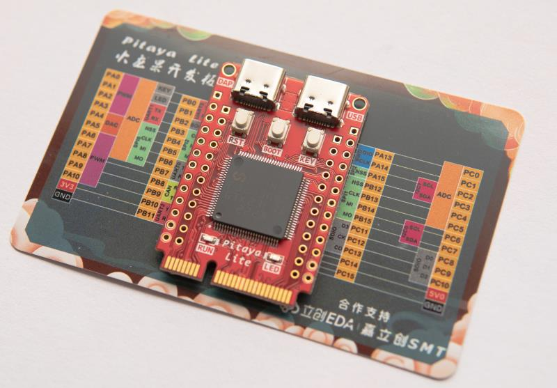

# Port TinyMaix to MM32F3270

## Chip
|Item |Parameter|
|--   |--|
|Chip |MM32F3270|
|Arch |ARM Cortex M3|
|Freq |96M |
|Flash|512KB|
|RAM  |128KB|
|Acceleration| CPU |

## Board

## Development Environment
MDK 5.37

## Step/Project
Just simple edit tm_port.h...   

## Result
|config  |mnist|cifar|vww96|mbnet96|Note|
|---     |---  |---  |---    |---     |---|
|O0 CPU  |11    |308  |2919    |3126     ||
|O1 CPU  |11    |257  |3318    |3528     ||

## Author

YuzukiTsuru <gloomyghost@gloomyghost.com>

https://github.com/YuzukiHD/Pitaya-TinyMaix

