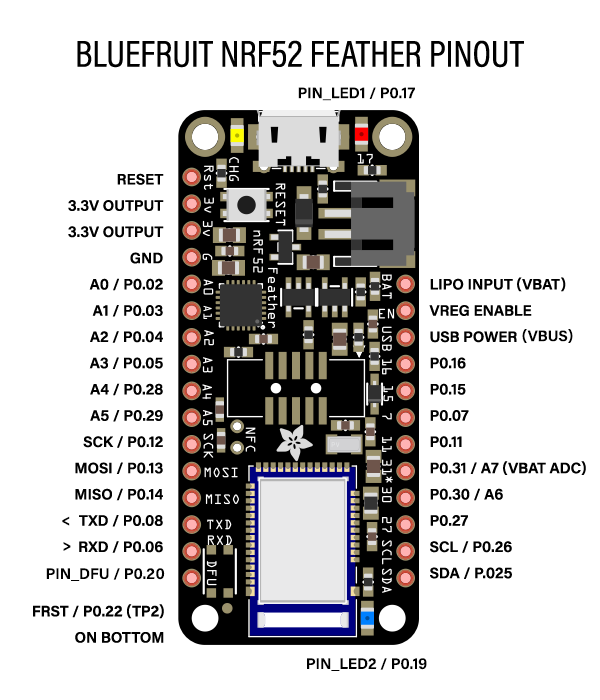

# Port TinyMaix to NRF52832

## Chip

| Item  | Parameter              |
| ----- | ---------------------- |
| Chip  | NRF52832               |
| Arch  | Cortex-M4 with FPU     |
| Freq  | 64M                    |
| Flash | 512KB                  |
| RAM   | 64KB                   |

## Board

## Development Environment

Arduino+PlatformIO

## Step/Project

`PlatformIO Project` https://github.com/Xiao-Echo/TinyMaix_NRF52832

Edit `tm_port.h`

## Result

| config | mnist | cifar   | vww96 | mbnet128 | Note |
| ------ | ----- | ------- | ----- | -------- | ---- |
| O0 CPU | 4.883 | 351.562 | XXX   | XXX      |      |
| O1 CPU | 4.883 | 411.132 | XXX   | XXX      |      |
| O0 SIMD| 3.906 | 254.882 | XXX   | XXX      |      |
| O1 SIMD| 3.906 | 217.773 | XXX   | XXX      |      |

## Author

[Xiao Hong](https://github.com/Xiao-Echo)
