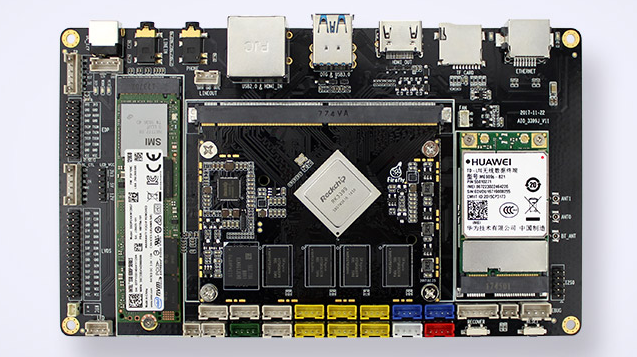

# Port TinyMaix to RK3399

## Chip

| Item         | Parameter                                     |
| ------------ | --------------------------------------------- |
| Chip         | RK3399                                        |
| Arch         | ARM Cortex-A72x2 + ARM Cortex-A53x4           |
| Freq         | ARM Cortex-A72 1.8GHz   ARM Cortex-A53 1.6GHz |
| Flash        | 32G                                           |
| RAM          | 4G                                            |
| Acceleration | ARM NEON                                      |

## Board

Firefly AIO-3399J

<a href="assets/AIO-RK3399j.png"></a>


## Development Environment

system:Ubuntu 22.04.1 LTS
compiler:aarch64-linux-gnu-11.2.0
note: cpu已最高频率运行


#### 使用

```shell
git clone  --recursive  https://github.com/lemonicesprite/rk3399-tinymaix.git
cd rk3399-tinymaix
make run
```

`TinyMaix/include/testdemo.h`中 宏定义`TASKCPUCORE`指定线程在哪个CPU核心上运行

## Step/Project
Just simple edit tm_port.h...   

Porting Project in:   
https://github.com/lemonicesprite/rk3399-tinymaix.git


## Result

| demo  | OPT1(A72) | OPT0(A72) | OPT1(A53) | OPT0(A53) |
| :---: | :-------: | :-------: | :-------: | :-------: |
| mnist |  0.066ms  |  0.088ms  |  0.144ms  | 0.154 ms  |
| cifar |  2.91ms   |  3.726ms  |  4.907ms  |  7.563ms  |
|  vww  |  9.91ms   |  9.939ms  | 19.275ms  | 21.124ms  |
| mbnet | 14.846ms  | 17.909ms  | 28.836ms  | 38.321ms  |


## Author
lemonicesprite@foxmail.com

