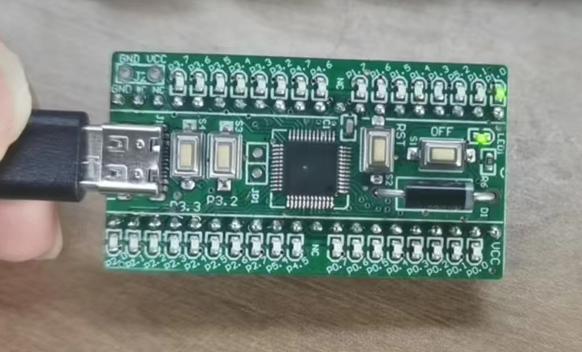

# Port TinyMaix to STC32G12K128

### Test Chip

| Item         | Parameter          |
| ------------ | ------------------ |
| Chip         | STC32G12K128       |
| Arch         | 80251              |
| Freq         | 35MHz              |
| Flash        | 128KB              |
| RAM          | 12kB               |
| Acceleration | ---                 |

### Board




### Development Environment
MDK

### Step/Project
- https://github.com/Zepan/TinyMaix_STC32G12K128


Program Size: data=8.1 edata+hdata=3046 xdata=0 const=4006 code=12133

### Result

```
mnist demo
  0,  0,  0,  0,  0,  0,  0,  0,  0,  0,  0,  0,  0,  0,  0,  0,  0,  0,  0,  0,  0,  0,  0,  0,  0,  0,  0,  0,
  0,  0,  0,  0,  0,  0,  0,  0,  0,  0,  0,  0,  0,  0,  0,  0,  0,  0,  0,  0,  0,  0,  0,  0,  0,  0,  0,  0,
  0,  0,  0,  0,  0,  0,  0,  0,  0,  0,  0,  0,  0,  0,  0,  0,  0,  0,  0,  0,  0,  0,  0,  0,  0,  0,  0,  0,
  0,  0,  0,  0,  0,  0,  0,  0,  0,  0,116,125,171,255,255,150, 93,  0,  0,  0,  0,  0,  0,  0,  0,  0,  0,  0,
  0,  0,  0,  0,  0,  0,  0,  0,  0,169,253,253,253,253,253,253,218, 30,  0,  0,  0,  0,  0,  0,  0,  0,  0,  0,
  0,  0,  0,  0,  0,  0,  0,  0,169,253,253,253,213,142,176,253,253,122,  0,  0,  0,  0,  0,  0,  0,  0,  0,  0,
  0,  0,  0,  0,  0,  0,  0, 52,250,253,210, 32, 12,  0,  6,206,253,140,  0,  0,  0,  0,  0,  0,  0,  0,  0,  0,
  0,  0,  0,  0,  0,  0,  0, 77,251,210, 25,  0,  0,  0,122,248,253, 65,  0,  0,  0,  0,  0,  0,  0,  0,  0,  0,
  0,  0,  0,  0,  0,  0,  0,  0, 31, 18,  0,  0,  0,  0,209,253,253, 65,  0,  0,  0,  0,  0,  0,  0,  0,  0,  0,
  0,  0,  0,  0,  0,  0,  0,  0,  0,  0,  0,  0,  0,117,247,253,198, 10,  0,  0,  0,  0,  0,  0,  0,  0,  0,  0,
  0,  0,  0,  0,  0,  0,  0,  0,  0,  0,  0,  0, 76,247,253,231, 63,  0,  0,  0,  0,  0,  0,  0,  0,  0,  0,  0,
  0,  0,  0,  0,  0,  0,  0,  0,  0,  0,  0,  0,128,253,253,144,  0,  0,  0,  0,  0,  0,  0,  0,  0,  0,  0,  0,
  0,  0,  0,  0,  0,  0,  0,  0,  0,  0,  0,176,246,253,159, 12,  0,  0,  0,  0,  0,  0,  0,  0,  0,  0,  0,  0,
  0,  0,  0,  0,  0,  0,  0,  0,  0,  0, 25,234,253,233, 35,  0,  0,  0,  0,  0,  0,  0,  0,  0,  0,  0,  0,  0,
  0,  0,  0,  0,  0,  0,  0,  0,  0,  0,198,253,253,141,  0,  0,  0,  0,  0,  0,  0,  0,  0,  0,  0,  0,  0,  0,
  0,  0,  0,  0,  0,  0,  0,  0,  0, 78,248,253,189, 12,  0,  0,  0,  0,  0,  0,  0,  0,  0,  0,  0,  0,  0,  0,
  0,  0,  0,  0,  0,  0,  0,  0, 19,200,253,253,141,  0,  0,  0,  0,  0,  0,  0,  0,  0,  0,  0,  0,  0,  0,  0,
  0,  0,  0,  0,  0,  0,  0,  0,134,253,253,173, 12,  0,  0,  0,  0,  0,  0,  0,  0,  0,  0,  0,  0,  0,  0,  0,
  0,  0,  0,  0,  0,  0,  0,  0,248,253,253, 25,  0,  0,  0,  0,  0,  0,  0,  0,  0,  0,  0,  0,  0,  0,  0,  0,
  0,  0,  0,  0,  0,  0,  0,  0,248,253,253, 43, 20, 20, 20, 20,  5,  0,  5, 20, 20, 37,150,150,150,147, 10,  0,
  0,  0,  0,  0,  0,  0,  0,  0,248,253,253,253,253,253,253,253,168,143,166,253,253,253,253,253,253,253,123,  0,
  0,  0,  0,  0,  0,  0,  0,  0,174,253,253,253,253,253,253,253,253,253,253,253,249,247,247,169,117,117, 57,  0,
  0,  0,  0,  0,  0,  0,  0,  0,  0,118,123,123,123,166,253,253,253,155,123,123, 41,  0,  0,  0,  0,  0,  0,  0,
  0,  0,  0,  0,  0,  0,  0,  0,  0,  0,  0,  0,  0,  0,  0,  0,  0,  0,  0,  0,  0,  0,  0,  0,  0,  0,  0,  0,
  0,  0,  0,  0,  0,  0,  0,  0,  0,  0,  0,  0,  0,  0,  0,  0,  0,  0,  0,  0,  0,  0,  0,  0,  0,  0,  0,  0,
  0,  0,  0,  0,  0,  0,  0,  0,  0,  0,  0,  0,  0,  0,  0,  0,  0,  0,  0,  0,  0,  0,  0,  0,  0,  0,  0,  0,
  0,  0,  0,  0,  0,  0,  0,  0,  0,  0,  0,  0,  0,  0,  0,  0,  0,  0,  0,  0,  0,  0,  0,  0,  0,  0,  0,  0,
  0,  0,  0,  0,  0,  0,  0,  0,  0,  0,  0,  0,  0,  0,  0,  0,  0,  0,  0,  0,  0,  0,  0,  0,  0,  0,  0,  0,
================================ model stat ================================
mdl_type=0 (0 int8, 1 int16, 2 fp32)
out_deq=1 
input_cnt=1, output_cnt=1, layer_cnt=6
input 3dims: (28, 28, 1)
output 1dims: (1, 1, 10)
main buf size 1464; sub buf size 0
//Note: PARAM is layer param size, include align padding

Idx	Layer	         outshape	inoft	outoft	PARAM	MEMOUT OPS
---	Input    	 28, 28,  1	-   	0    	0 	1988494096 	0
000	Conv2D      	 13, 13,  4	0	0	784	4718592	6084
001	Conv2D      	  6,  6,  8	784	0	0	23068672	10368
002	Conv2D      	  2,  2, 16	0	0	1400	83886080	4608
003	GAP      	  1,  1, 16	1400	0	0	0	64
004	FC      	  1,  1, 10	0	0	1448	15728640	160
005	Softmax      	  1,  1, 10	1448	0	0	0	60

Total param ~1.9 KB, OPS ~0.02 MOPS, buffer 1.4 KB

===tm_run use 37 ms
### Predict output is: Number 2 , Prob 0.996
```

TM_MDL_INT8 (ms)

| config    | mnist | mnist with FASTSCALE   |
| --------- | ----- | ------- |
| O0 CPU    | 61    | 37      |


### Author
zepan <zepan@sipeed.com>
