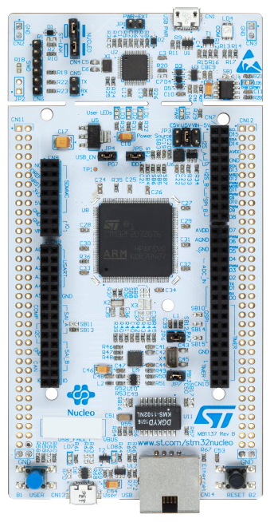

# Port TinyMaix to STM32f767

## Chip
| Item         | Parameter     |
| ------------ | ------------- |
| Chip         | STM32F767ZIT6 |
| Arch         | ARM Cortex M7 |
| Freq         | 216M          |
| Flash        | 2048KB        |
| RAM          | 512KB         |
| Acceleration | ARM SIMD      |

## Board
NUCLEO-F767ZI  

## Development Environment
system:Ubuntu 22.04.1 LTS
compiler:gcc-arm-none-eabi-7-2018-q2-update
tools: STM32CubeMX 6.6.0 with STM32Cube FW_F7 V1.17.0

## Step/Project

Porting Project in:   
https://github.com/lemonicesprite/stm32f767-tinymaix

## Result
| config  | mnist | cifar | vww96 | mbnet128 | Note |
| ------- | ----- | ----- | ----- | -------- | ---- |
| O1 CPU  | 3     | 282   | 890   | 1411     |      |
| O1 SIMD | 3     | 185   | 640   | 869      |      |

## Note
linux下arm-none-eabi-gcc编译后的程序执行效率不及MDK中的armcc

## Author
lemonicesprite@foxmail.com
