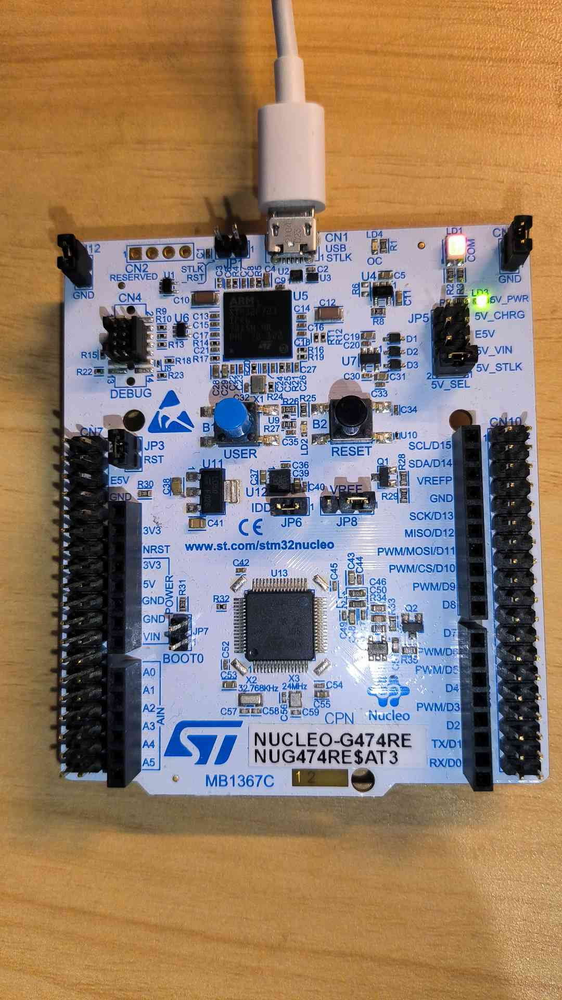

# Port TinyMaix to STM32G474

## Chip

| Item         | Parameter     |
| ------------ | ------------- |
| Chip         | STM32G474     |
| Arch         | ARM Cortex M4 |
| Freq         | 170M          |
| Flash        | 512KB         |
| RAM          | 128KB         |
| Acceleration | ARM SIMD      |

## Board

NUCLEO-G474RE  

## Development Environment

MDK 5.35

## Step/Project

Just simple edit `tm_port.h`

https://github.com/dreamcmi/STM32G474-TinyMaix

## Result

| config  | mnist | cifar | vww96  | mbnet128 | Note |
| ------- | ----- | ----- | ------ | -------- | ---- |
| O0 CPU  | 1.38  | 79.16 | 228.78 | XXX      |      |
| O1 CPU  | 1.32  | 57.41 | 229.05 | XXX      |      |
| O0 SIMD | 1.12  | 57.45 | 194.74 | XXX      |      |
| O1 SIMD | 1.01  | 42.98 | 198.64 | XXX      |      |

## Author

[Darren Cheng](https://github.com/dreamcmi) 

