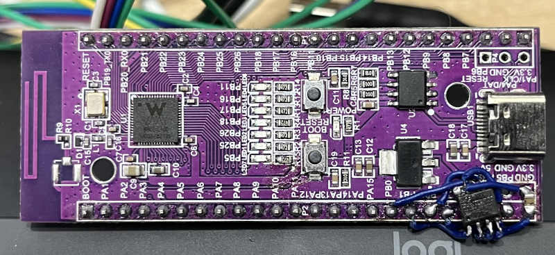

# Port TinyMaix to W801

## Chip

|Item |Parameter|
|---   |---|
|Chip |W801|
|Arch |CSKYV2 ck804ef|
|Freq |240M |
|Flash|2MB|
|RAM  |160+128KB|
|PSRAM  |8MB|
|Acceleration|CskyV2 DSPv2|

## Board
WLK-W801-KIT-V1.0 with addon PSRAM  
<a href="assets/W801.jpg"></a>
<a href="assets/w801-yolo.jpg"></a>

## Development Environment
csky-abiv2-toolchain with cmake

## Step/Project
Just simple edit tm_port.h with     
`````
#define TM_ARCH         TM_ARCH_CSKYV2
#include "wm_osal.h"
#define  TM_GET_US()       ((tls_os_get_time()*2000))
`````
Porting Project in:   
https://www2.tinyelectech.com/hailin/wm_sdk_w801/-/tree/psram_SDIO
https://www2.tinyelectech.com/hailin/wm_sdk_w801/-/tree/yolo


## Result

|config  |mnist|cifar|vww96|mbnet128|yolov2|Note|
|---     |---  |---  |---    |---     |---| ---|
|O1 CSKYV2  |<2    |52  |364    |606   | 130000 |copy model to psram or ram|

## Note
W801 Flash is too small to place yolov2 mdl, use xmodem upload tmdl file at boot instead.   
Low 160 KB RAM is much faster than high 128 KB, try not to use 128KB part, and psram is faster than flash.  
speed:  
LOW RAM>HIGH RAM    
LOW RAM>PSRAM>FLASH

runing big model(like yolov2), buffer need to alloc at psram(need to modify tm_layers.c and tm_model.c)

## Author
3dgans@outlook.com


