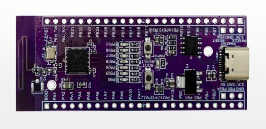

## Port TinyMaix to W801

## Chip

| Item  | Parameter |
| ----- | --------- |
| Chip  | W801      |
| Arch  | XT804     |
| Freq  | 240M      |
| Flash | 2MB       |
| RAM   | 288KB     |

## Board

HLK-W801-KIT-V1.0

## Development Environment

csky-elfabiv2-tools-x86_64-minilibc

## Step/Project

Just simple edit `tm_port.h`

Porting Project in:   
https://github.com/sunnycase/W801-TinyMaix

## Result

TM_MDL_INT8 (ms)

| config | mnist | cifar | vww96 | mbnet128  |
| ------ | ----- | ----- | ----- | --------- |
| O0     | 6     | 316   | 6420  | 12041.999 |
| O1     | 22    | 3088  | 6850  | 12520     |

TM_MDL_FP32(ms)

| config | mnist | cifar |
| ------ | ----- | ----- |
| O0     | 10    | 860   |
| O1     | 24    | 3094  |

## Author

sunnycase@live.cn
