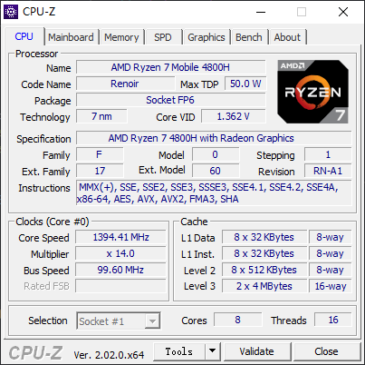

# Port TinyMaix to Windows x86/x64/ARM64

Port Repo: https://github.com/UMUISM/TinyMaix-Windows

## Windows 10 x64

### Test Chip

| Item         | Parameter                                                    |
| ------------ | ------------------------------------------------------------ |
| Chip         | AMD Ryzen 7 4800H with Radeon Graphics  L1:512 KB L2 :4.0 MB L3 :8.0 MB  |
| Arch         | AMD64                                                        |
| Freq         | 2.90GHz                                                      |
| Flash        | 4TB                                                          |
| RAM          | 32GB                                                         |
| Acceleration | CPU                                                          |

### Board
OMEN Laptop 15-en0xxx

### Development Environment
Visual Studio 2022

### Step/Project
- Commit [#11](https://github.com/sipeed/TinyMaix/pull/11)
- Commit [#12](https://github.com/sipeed/TinyMaix/pull/12)
- Commit [#16](https://github.com/sipeed/TinyMaix/pull/16)

### Result

TM_MDL_INT8

| config | mnist    | cifar | vww96 | mbnet128 | kws  |
| ------ | -------- | ----- | ----- | -------- | ---- |
| O0 CPU | 1        | 1     | 4     | 6        | 12   |
| O1 CPU | 0(470us) | 1     | 3     | 6        | 12   |

TM_MDL_FP32

| config | mnist    | cifar | vww96 | mbnet128 | kws  |
| ------ | -------- | ----- | ----- | -------- | ---- |
| O0 CPU | 2        | 3     | 4     | 6        | XX   |
| O1 CPU | 1        | 2     | 4     | 6        | XX   |

### Author
YuzukiTsuru <gloomyghost@gloomyghost.com>
