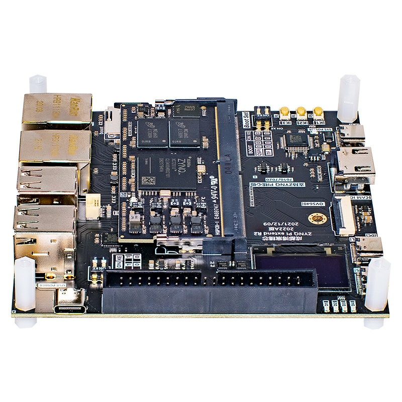

<!--
 * @Author: HanShuo
 * @Date: 2022-09-29 21:50:16
 * @LastEditors: HanShuo
 * @LastEditTime: 2022-09-29 22:11:57
 * @Description: 
 * Copyright (c) 2022 by HanShuo, All Rights Reserved.
-->
# Port TinyMaix to ZYNQ-7010

### Test Chip

| Item         | Parameter      |
| ------------ | -------------- |
| Chip         | ZYNQ-7010      |
| Arch         | ARM Cortex-A9  |
| Freq         | 667MHz         |
| Flash        | 32GByte        |
| RAM          | 1GByte         |
| Acceleration | CPU            |

### Board

### Development Environment

PYNQ(Ubuntu 18.04)

### Step/Project

Edit tm_port.h
If use TM_ARCH_ARM_NEON，add it to CMakeLists.txt:
    add_definitions(-mfpu=neon)

### Result

TM_MDL_INT8 (ms)

| config | mnist | cifar | vww96  | mbnet128 | kws   |
| ------ | ----- | ----- | ------ | -------- | -------|
| O0 CPU | 0.303 | 12.937| 48.836 | 87.131   | 828.400|
| O1 CPU | 0.306 | 11.696| 50.169 | 77.300   | 849.267|
| O0 NEON| 0.522 | 8.111 | 43.712 | 77.977   | 833.720|
| O1 NEON| 0.340 | 7.803 | 44.230 | 65.748   | 785.745|

TM_MDL_FP32 (ms)

| config | mnist    | cifar | vww96 | mbnet128 | kws  |
| ------ | -------- | ----- | ----- | -------- | ---- |
| O0 CPU | 0.415    | 29.750| 64.337| 120.976  | XX   |
| O1 CPU | 0.278    | 19.097| 58.932| 96.547   | XX   |
| O0 NEON| 0.365    | 20.637| 44.474| 103.777  | XX   |
| O1 NEON| 0.293    | 12.369| 47.498| 77.704   | XX   |

### Author

[Anuo](https://github.com/Anuo-shuo)
