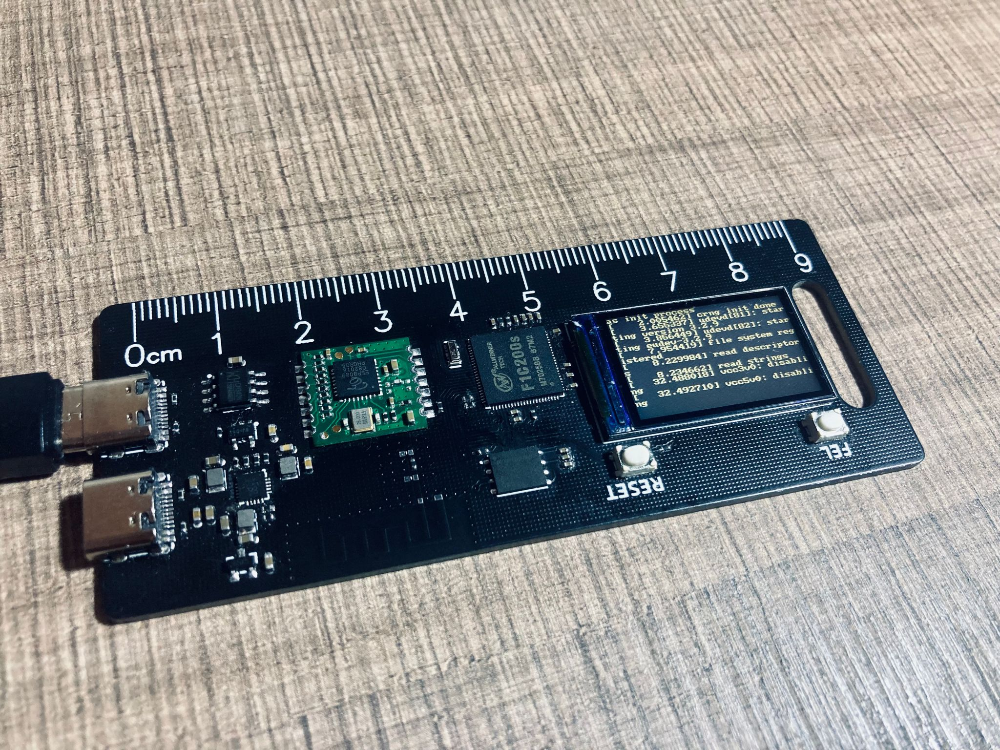

# Port TinyMaix to F1C200S

### Test Chip

| Item         | Parameter         |
| ------------ | ----------------- |
| Chip         | Allwinner F1C200S |
| Arch         | ARM ARM926EJ-S    |
| Freq         | 608MHz            |
| Flash        | 16MByte           |
| RAM          | 64MB DDR          |
| Acceleration | CPU               |

### Board

### Development Environment
Linux 5.4.180

### Step/Project
Nothing, Compile it.

### Result

TM_MDL_INT8 (ms)

| config | mnist | cifar  | vww96   | mbnet128 |
| ------ | ----- | ------ | ------- | -------- |
| O0 CPU | 0.780 | 40.559 | 145.553 | 237.257  |
| O1 CPU | 0.753 | 38.541 | 145.958 | 213.304  |

### Author
YuzukiTsuru <gloomyghost@gloomyghost.com>
