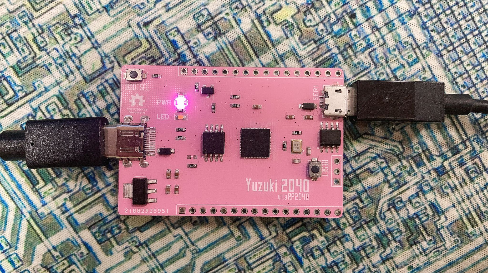

# Port TinyMaix to RP2040

### Test Chip

| Item         | Parameter          |
| ------------ | ------------------ |
| Chip         | RaspberryPi RP2040 |
| Arch         | ARM Cortex-M0+     |
| Freq         | 133MHz             |
| Flash        | 16MByte            |
| RAM          | 264kB              |
| Acceleration | CPU                |

### Board

### Development Environment
pico-sdk

### Step/Project
- https://github.com/YuzukiHD/TinyMaix-RP2040

### Result

TM_MDL_INT8 (ms)

| config        | mnist | cifar   | vww96    | mbnet128 |
| ------------- | ----- | ------- | -------- | -------- |
| O0 CPU@133MHz | 6.095 | 503.308 | 1631.352 | 2938.584 |
| O1 CPU@133MHz | 5.634 | 461.047 | 1763.563 | 2759.845 |
| O0 CPU@280MHz | 2.745 | 221.211 | 715.827  | 1292.433 |
| O1 CPU@280MHz | 1.975 | 200.302 | 772.447  | 1210.660 |

### Author
YuzukiTsuru <gloomyghost@gloomyghost.com>
