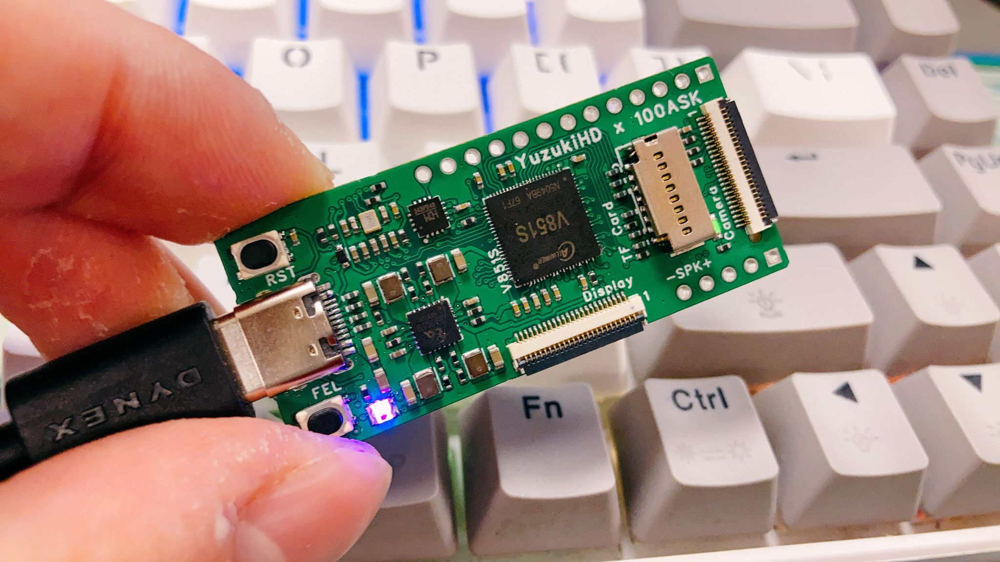

# Port TinyMaix to V85x E907

### Test Chip

| Item         | Parameter                      |
| ------------ | ------------------------------ |
| Chip         | Allwinner V85x E907 Core       |
| Arch         | Xuantie E907 RV32IMAC @ 600MHz |
| Freq         | 600MHz                         |
| Flash        | 128MByte                       |
| RAM          | 4096KB DDR2 SDRAM              |
| Acceleration | CPU                            |

### Board

### Development Environment
RT-Thread OpenAMP With Remoteproc

### Step/Project
- https://github.com/YuzukiHD/Yuzukilizard/tree/master/Software/BSP/e907_rtos

### Result

TM_MDL_INT8 (ms)

| config | mnist | cifar  | vww96   | mbnet96 |
| ------ | ----- | ------ | ------- | ------- |
| O0 CPU | 0.516 | 30.831 | 107.497 | 117.373 |
| O1 CPU | 0.488 | 32.276 | 99.292  | 107.823 |

### Author
YuzukiTsuru <gloomyghost@gloomyghost.com>

