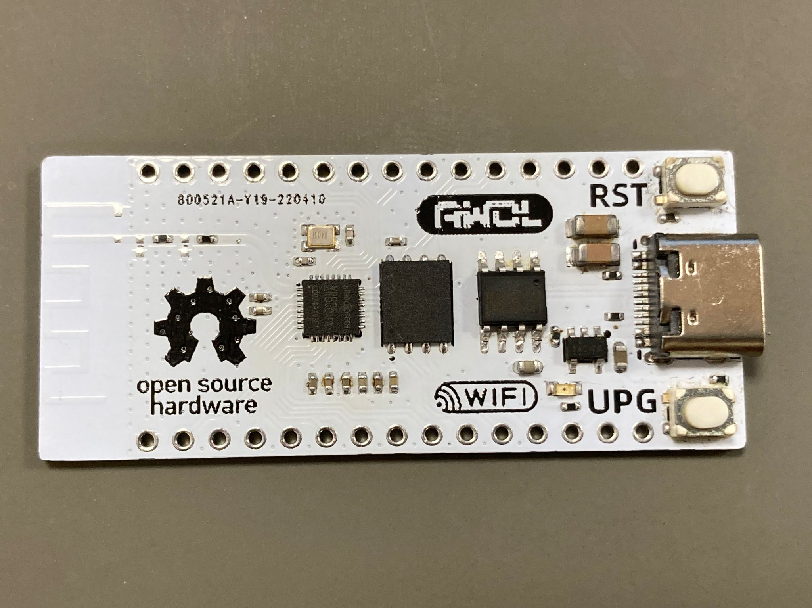

# Port TinyMaix to XR806

### Test Chip

| Item         | Parameter                       |
| ------------ | ------------------------------- |
| Chip         | Xradio Tech XR806               |
| Arch         | Arm-Star ARMv8-M Core, Star-MC1 |
| Freq         | 160MHz                          |
| Flash        | 16Mbit                          |
| RAM          | 288KB SRAM                      |
| Acceleration | CPU                             |

### Board

### Development Environment
FreeRTOS

### Step/Project
- https://github.com/YuzukiHD/TinyMaix-XR806

### Result

TM_MDL_INT8 (ms)

| config | mnist (SRAM) | cifar | vww96 (Flash XIP) 32K Cache | mbnet128 (Flash XIP) 32K Cache | mbnet128 (Flash XIP) no Cache |
| ------ | ------------ | ----- | --------------------------- | ------------------------------ | ----------------------------- |
| O0 CPU | 2            | 134   | 459                         | 844                            | 42530                         |
| O1 CPU | 1            | 104   | 453                         | 712                            | 35576                         |

### Author
YuzukiTsuru <gloomyghost@gloomyghost.com>
